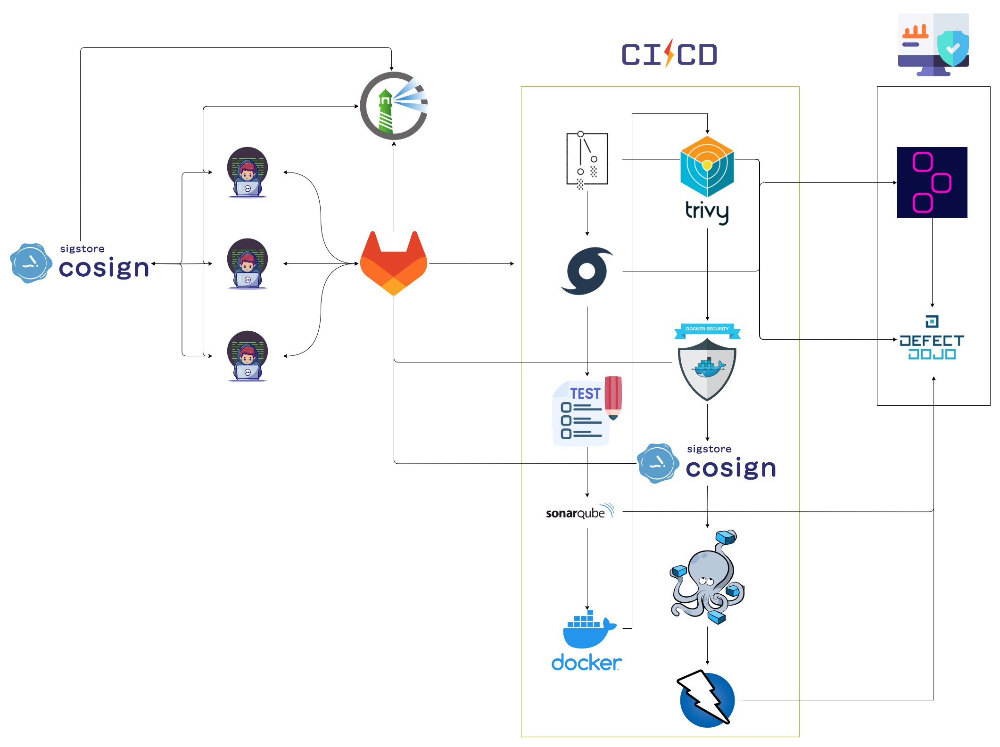

---
layout:
  title:
    visible: true
  description:
    visible: true
  tableOfContents:
    visible: true
  outline:
    visible: true
  pagination:
    visible: false
---

# 👋 Introducción

La metodología de desarrollo SecDevOps, que combina los principios de seguridad (Security), desarrollo (Development) y operaciones (Operations), ha surgido como una respuesta eficaz a los desafíos cada vez más complejos y cambiantes del mundo tecnológico actual. Esta metodología se centra en la integración temprana de la seguridad en todo el ciclo de vida del desarrollo de software, permitiendo la entrega continua de aplicaciones robustas y seguras. SevDevOps no solo aborda las necesidades de agilidad y eficiencia en el desarrollo, sino que también pone un énfasis crucial en la protección de datos sensibles, la prevención de vulnerabilidades y la respuesta efectiva a posibles amenazas.

Para ello hemos creado el siguiente marco de trabajo Open SecDevOps (OSDO) para poder llevar la seguridad en el desarrollo a todo el mundo con herramientas libres.

<figure><figcaption>
Diagrama de trabajo
</figcaption></figure>

### Cómo funciona

La metodología SecDevOps se basa en la colaboración estrecha entre equipos de desarrollo y operaciones, con la seguridad incorporada desde el inicio del proceso. A través de un enfoque iterativo e incremental, SecDevOps fomenta la creación de una cultura de seguridad en toda la organización. A continuación, se describen los componentes clave de cómo funciona SecDevOps:

**Integración Continua de la Seguridad:** En lugar de tratar la seguridad como un paso final, SecDevOps promueve la integración continua de prácticas de seguridad desde el diseño inicial hasta la implementación. Los equipos de desarrollo y seguridad colaboran para identificar posibles riesgos y vulnerabilidades desde el comienzo del proceso de desarrollo.

**Automatización y Pruebas Continuas:** SecDevOps se basa en la automatización de pruebas de seguridad a lo largo del ciclo de vida del desarrollo. Esto incluye pruebas estáticas (SAST) y dinámicas (DAST) para detectar vulnerabilidades en el código y en el entorno de ejecución. Las pruebas automatizadas garantizan una detección temprana y una corrección más eficiente de problemas de seguridad.

**Despliegue Continuo y Monitorización:** La entrega continua es un pilar fundamental de SecDevOps. Los cambios en el código se implementan de manera continua y controlada, lo que reduce el riesgo de problemas de seguridad causados por cambios drásticos. Además, la monitorización constante permite la detección rápida de comportamientos anómalos y ataques en tiempo real.
