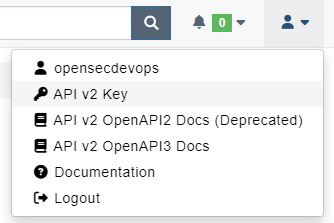
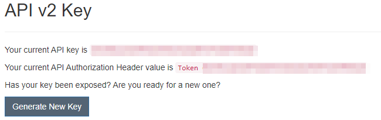
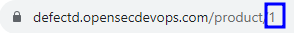
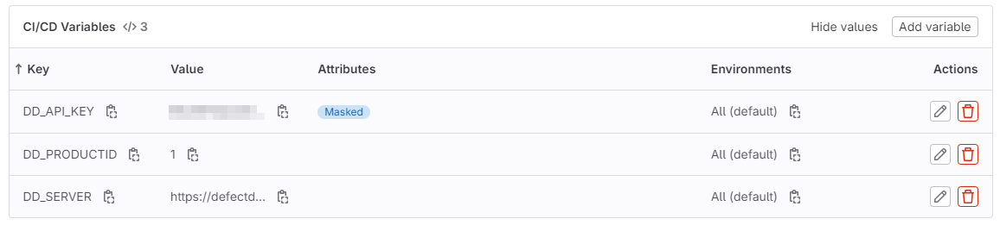

---
layout:
  title:
    visible: true
  description:
    visible: false
  tableOfContents:
    visible: true
  outline:
    visible: true
  pagination:
    visible: true
---

# Integraciones Monitorización

Para centralizar todos los problemas de seguridad que puedan surgir en las diferentes fases del pipeline, realizaremos la integración con nuestras herramientas de monitorización.

### DefectDojo

Para integrar [DefectDojo, ](../monitorizacion/defectdojo/)lo primero que tenemos que hacer es [crear un proyecto](../monitorizacion/defectdojo/producto.md#creacion). Una vez que hayamos creado el proyecto, necesitaremos dos componentes en nuestro pipeline. El primero consistirá en crear un stage que preceda a todas las secciones y que creará un engagement (compromiso) para esa ejecución. Luego, desarrollaremos una función reutilizable para importar los diferentes análisis\
\
Para ambos casos, utilizaremos la API de DefectDojo, la cual requiere autenticación. Esta información se encuentra en la parte superior derecha de la interfaz de DefectDojo.


<figure><figcaption><p>Menú API Key</p></figcaption></figure>

Una vez allí, podremos ver la API Key, que debe ser incluida en nuestras solicitudes en la cabecera bajo el encabezado `Authorization: Token XXXXXXXXXXXXXX`


<figure><figcaption><p>Show API Key</p></figcaption></figure>

El punto final API v2 simplemente consiste en la URL base de su instancia de DefectDojo + '/api/v2' (por ejemplo, https://defectdojo.example.com/api/v2 ).

La identificación de su producto se puede obtener a partir de la URL cuando accede al producto en la interfaz de usuario.

<figure><figcaption><p>Id producto</p></figcaption></figure>

#### Engagement

Ahora que disponemos de los datos, crearemos nuestro engagement. Para ello, crearemos un stage llamado '.pre', el cual nos devolverá un ID que almacenaremos en una nueva variable de entorno. Luego, pasaremos este ID a las siguientes tareas relacionadas con DefectDojo utilizando el artefacto '[artifacts:reports:dotenv'](https://docs.gitlab.com/ee/ci/yaml/artifacts\_reports.html#artifactsreportsdotenv).&#x20;

Lo primero que debemos hacer es crear las variables del CI, que son las siguientes:

* **DD\_SERVER:** La dirección del servidor de DefectDojo.
* **DD\_API\_KEY:** La clave de la API para autenticarse en DefectDojo. Asegúrate de marcar el atributo 'mask' para que no se muestre en los registros.
* **DD\_PRODUCTID:** El ID del producto en el que vamos a crear el engagement.

<figure><figcaption><p>Gitlab CI/CD Variables</p></figcaption></figure>

Vamos a crear un archivo llamado `defectdojo-engagement.sh` en la carpeta `.gitlab-ci`, donde se incluirá la llamada `curl` que creará el engagement para esta ejecución del CI.


```bash
#!/bin/bash

TODAY=$(date +%Y-%m-%d)
ENDDAY=$(date -d "+${DD_ENGAGEMENT_PERIOD} days" +%Y-%m-%d)

ENGAGEMENTID=$(curl --fail --location --request POST "${DD_SERVER}/api/v2/engagements/" \
  -H "Authorization: Token ${DD_API_KEY}" \
  -H 'Content-Type: application/json' \
  --data-raw "{
    \"tags\": [\"GITLAB-CI\"],
    \"name\": \"#${CI_PIPELINE_ID}\",
    \"description\": \"${CI_COMMIT_DESCRIPTION}\",
    \"version\": \"${CI_COMMIT_REF_NAME}\",
    \"first_contacted\": \"${TODAY}\",
    \"target_start\": \"${TODAY}\",
    \"target_end\": \"${ENDDAY}\",
    \"reason\": \"string\",
    \"tracker\": \"${CI_PROJECT_URL}/-/issues\",
    \"threat_model\": \"${DD_ENGAGEMENT_THREAT_MODEL}\",
    \"api_test\": \"${DD_ENGAGEMENT_API_TEST}\",
    \"pen_test\": \"${DD_ENGAGEMENT_PEN_TEST}\",
    \"check_list\": \"${DD_ENGAGEMENT_CHECK_LIST}\",
    \"status\": \"${DD_ENGAGEMENT_STATUS}\",
    \"engagement_type\": \"CI/CD\",
    \"build_id\": \"${CI_PIPELINE_ID}\",
    \"commit_hash\": \"${CI_COMMIT_SHORT_SHA}\",
    \"branch_tag\": \"${CI_COMMIT_REF_NAME}\",
    \"deduplication_on_engagement\": \"${DD_ENGAGEMENT_DEDUPLICATION_ON_ENGAGEMENT}\",
    \"product\": \"${DD_PRODUCTID}\",
    \"source_code_management_uri\": \"${CI_PROJECT_URL}\",
    \"build_server\": ${DD_ENGAGEMENT_BUILD_SERVER},
    \"source_code_management_server\": ${DD_ENGAGEMENT_SOURCE_CODE_MANAGEMENT_SERVER},
    \"orchestration_engine\": ${DD_ENGAGEMENT_ORCHESTRATION_ENGINE}
  }" | jq -r '.id')

echo "DD_ENGAGEMENTID=${ENGAGEMENTID}" >> defectdojo.env

```


Desde nuestro sgate de .pre vamos vamos a lanzar la creación del engagement llamando al anterior script.


```yaml
defectdojo_create_engagement:
  stage: .pre
  image: alpine
  variables:
    DD_NOT_ON_MASTER: "false"
    DD_ENGAGEMENT_PERIOD: 7
    DD_ENGAGEMENT_STATUS: "Not Started"
    DD_ENGAGEMENT_BUILD_SERVER: "null"
    DD_ENGAGEMENT_SOURCE_CODE_MANAGEMENT_SERVER: "null"
    DD_ENGAGEMENT_ORCHESTRATION_ENGINE: "null"
    DD_ENGAGEMENT_DEDUPLICATION_ON_ENGAGEMENT: "false"
    DD_ENGAGEMENT_THREAT_MODEL: "true"
    DD_ENGAGEMENT_API_TEST: "true"
    DD_ENGAGEMENT_PEN_TEST: "true"
    DD_ENGAGEMENT_CHECK_LIST: "true"
  rules:
    - if: '$DD_NOT_ON_MASTER == "true" && $CI_COMMIT_BRANCH == "master"'
      when: never
    - when: always
  before_script:
    - apk add curl jq coreutils
  script:
    - sh .gitlab-ci/defectdojo-engagement.sh 
  artifacts:
    reports:
      dotenv: defectdojo.env

```


Este stage en el archivo de configuración de GitLab CI/CD se llama "defectdojo\_create\_engagement".&#x20;

* **stage: .pre**: Este stage se ubica en la etapa `.pre` del pipeline, lo que significa que se ejecutará antes de otros stages en el pipeline.
* **image: alpine**: Utiliza la imagen Alpine Linux para ejecutar este stage.
* **variables**: Define una serie de variables de entorno que se utilizarán en este stage para configurar el engagement en DefectDojo. Por ejemplo, se establece la duración del engagement (`DD_ENGAGEMENT_PERIOD`) y varios indicadores de qué partes del engagement se crearán (`DD_ENGAGEMENT_THREAT_MODEL`, `DD_ENGAGEMENT_API_TEST`, `DD_ENGAGEMENT_PEN_TEST`, `DD_ENGAGEMENT_CHECK_LIST`).
* **rules**: Establece reglas que determinan cuándo se ejecutará este stage. Esta regla dice que si `$DD_NOT_ON_MASTER` es igual a `"true"` y `$CI_COMMIT_BRANCH` es igual a `"master"`, entonces el stage se ejecutará nunca (`when: never`). De lo contrario, se ejecutará siempre (`when: always`).
* **before\_script**: Aquí se definen los comandos que se ejecutarán antes del script principal. En este caso, se instalan las herramientas `curl`, `jq`, y `coreutils` utilizando `apk add`.
* **script**: El script que se ejecuta en este stage es `defectdojo-engagement.sh`, que se encuentra en la carpeta `.gitlab-ci`. Este script utiliza las variables definidas anteriormente para crear un engagement en DefectDojo utilizando `curl`.
* **artifacts**: Aquí se especifica que este stage generará un informe en forma de archivo `.env` llamado `defectdojo.env`, que se utilizará en otros stages del pipeline.

Con estos pasos, hemos creado nuestro engagement para esta ejecución, el cual será utilizado en los stages siguientes.

#### Findings

Para enviar los resultados de las diferentes herramientas, vamos a utilizar otro archivo en nuestra carpeta `.gitlab-ci` llamado `defectdojo-finding.sh`, el cual enviará los resultados a nuestro DefectDojo y al engagement correspondiente.


```bash
#!/bin/bash

TODAY=$(date +%Y-%m-%d)

curl --location --request POST "${DD_SERVER}/api/v2/import-scan/" \
    -H 'accept: application/json' \
    -H "Authorization: Token ${DD_API_KEY}" \
    -F "scan_date=${TODAY}" \
    -F "minimum_severity=${DD_SCAN_MINIMUM_SEVERITY}" \
    -F "active=${DD_SCAN_ACTIVE}" \
    -F "verified=${DD_SCAN_VERIFIED}" \
    -F "scan_type=${DD_SCAN_TYPE}" \
    -F "engagement=${DD_ENGAGEMENTID}" \
    -F "file=@gitleaks-report.json;type=application/json" \
    -F "close_old_findings=${DD_SCAN_CLOSE_OLD_FINDINGS}" \
    -F "environment=${DD_SCAN_ENVIRONMENT}" \
    -F "product_name=${DD_PRODUCT_NAME}"  \
    -F 'create_finding_groups_for_all_findings=true' \
    -F 'group_by=component_name+component_version'

```

