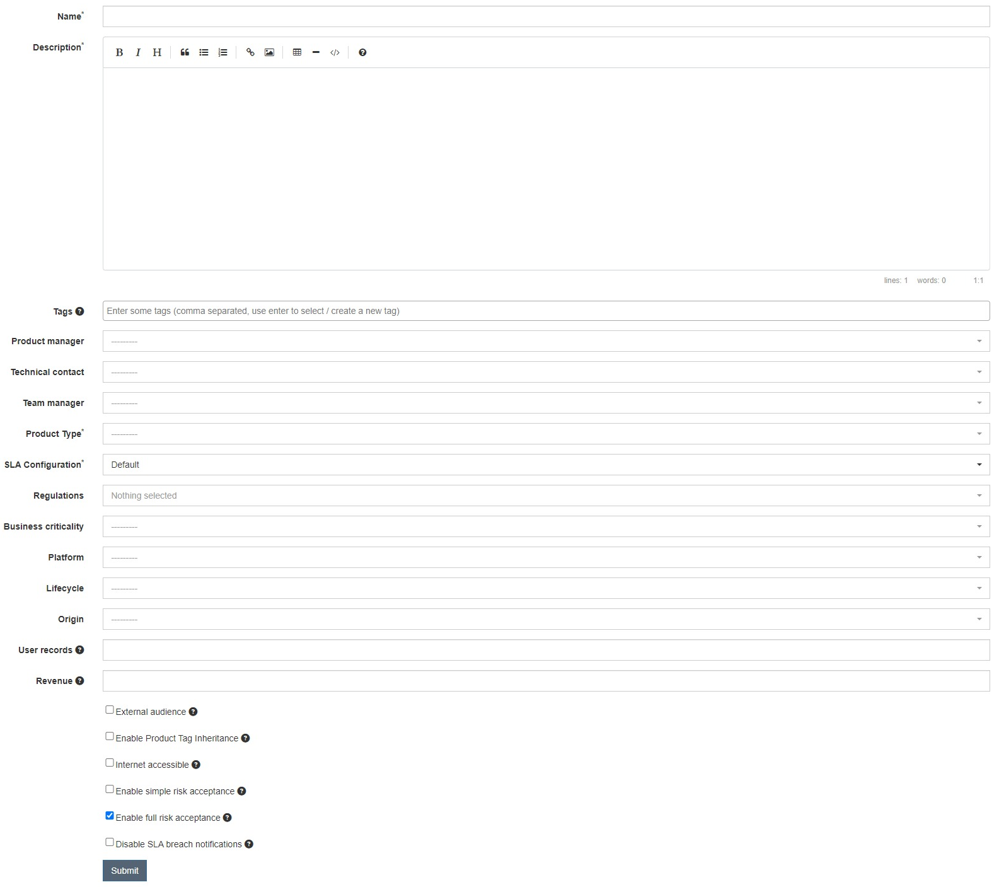
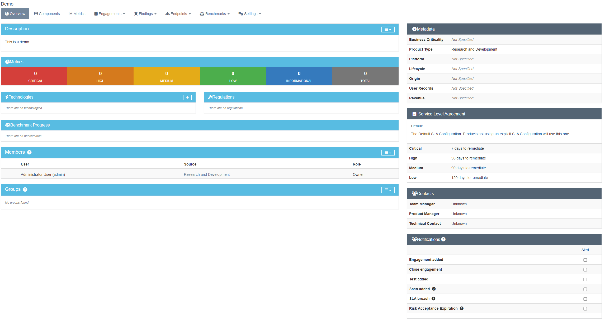

# Producto

En DefectDojo, un "producto" es una entidad que representa una aplicación, sistema o proyecto de software específico dentro de su entorno. Esencialmente, un producto en DefectDojo es una forma de organizar y gestionar las vulnerabilidades relacionadas con una aplicación o proyecto particular. Aquí tienes una explicación más detallada de lo que implica un producto en DefectDojo:

### Creación

Para crear un producto, debemos dirigirnos a la barra lateral, hacer clic en el icono de tres puntos con tres guiones y seleccionar "Add product". Esto nos llevará a la siguiente ventana.

<figure><figcaption>
Agregar producto
</figcaption></figure>

En este formulario tendremos los siguientes campos a rellenar:

* **Name:** Nombre del activo. (Obligatorio)
* **Description:** Descripción del producto. (Obligatorio)
* **Tags:** Tags para organizar los proyectos por grupos de trabajo, importancia...
* **Product manager:** Gestor del producto
* **Technical contact:** Tecnico de contacto
* **Team manager:** Manager del equipo que gestiona el producto
* **Product Type:** Tipo de producto (Sistemas, webapp...) se puede añadir todos los necesarios (Obligatorio)
* **SLA Configuration:** Tiempo de respuesta para la resolución de las incidencias. (Obligatorio)
* **Regulations:** Sobre que base legal se establece el producto.
* **Business criticality:** La criticidad del activo para la organización.
* **Platform:** Qué tipo de plataforma es el producto.
* **Lifecycle:** Ciclo de vida del producto.
* **Origin:** El origen del software( OpenSource, Internal...)
* **User records:** Usuarios estimados que usan la aplicación
* **Revenue:** Beneficio de la aplicación estimado.
* **External audience:** Aplicación interna o externa
* **Enable Product Tag Inheritance:** Si se activa las tags se hereda entre Engagement, Tests y Búsquedas
* &#x20;**Internet accessible:** Es accesible desde internet
* **Enable simple risk acceptance:** Habilita un checkbox para aceptar fácilmente el riesgo.
* **Enable full risk acceptance:** Se permite aceptar riesgos completos
* **Disable SLA breach notifications:** Se desactiva la roturas del SLA

Una vez creado, ya disponemos de nuestro producto donde iremos añadiendo la información de las diferentes vulnerabilidades.

<figure><figcaption>
Dasboard de producto
</figcaption></figure>

